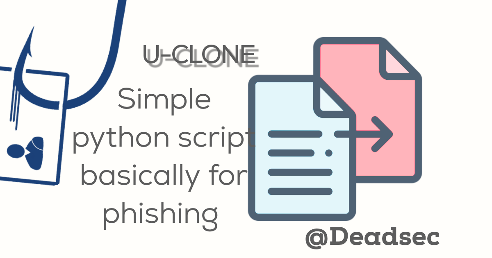
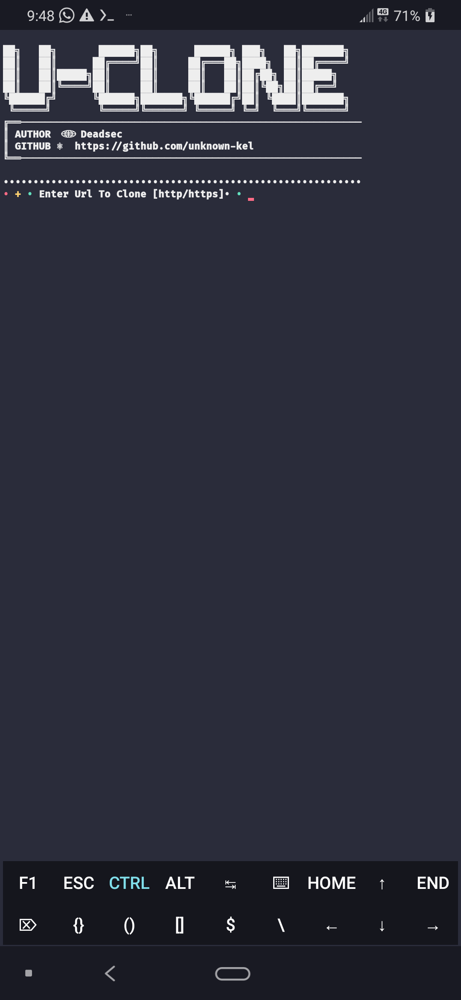

# U-Clone

### [+] Created By <a href="https://github.com/unknown-kel">unknown-kel</a>

### [+] Decription :
***Website Cloner For Phishing Attacks.***

### [+] Installation

```apt install git python -y```

```git clone https://github.com/unknown-kel/u-clone```

```cd u-clone```

```bash start.sh```


### Or, Use Single Command
```
apt install git python -y && git clone https://github.com/unknown-kel/u-clone && cd u-sporti && bash start.sh
```

## Screenshots:




